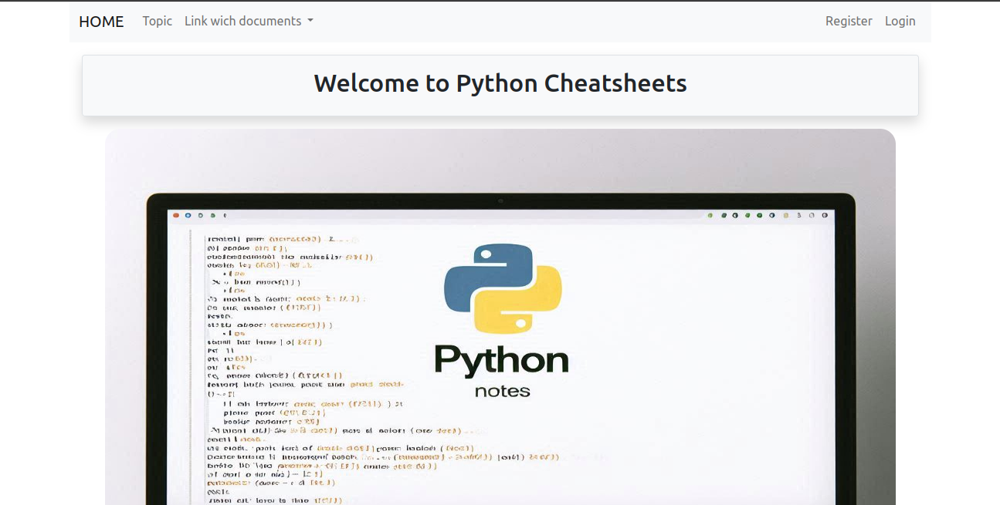
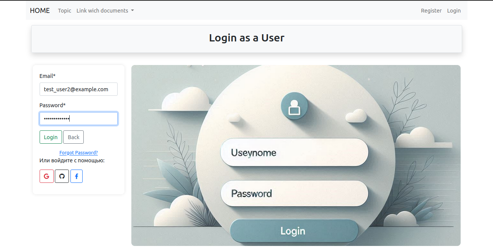
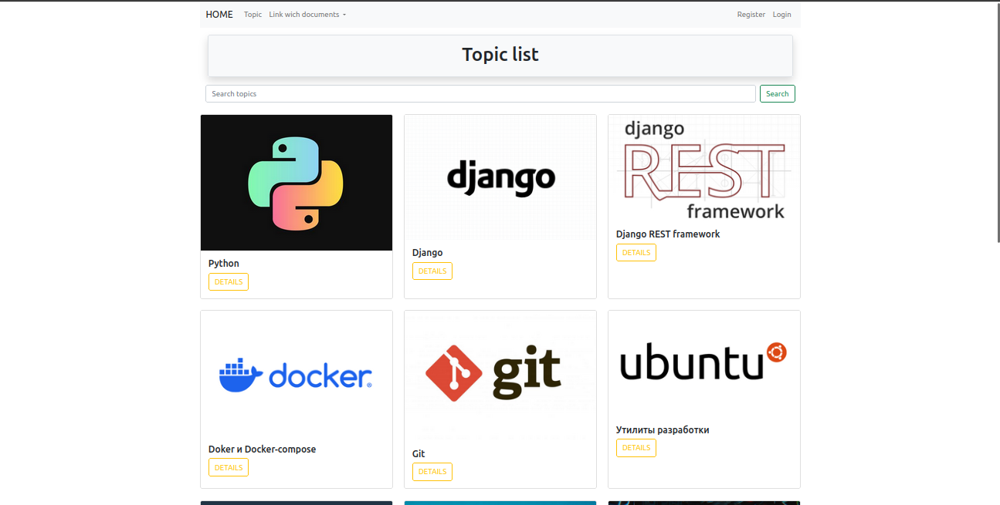
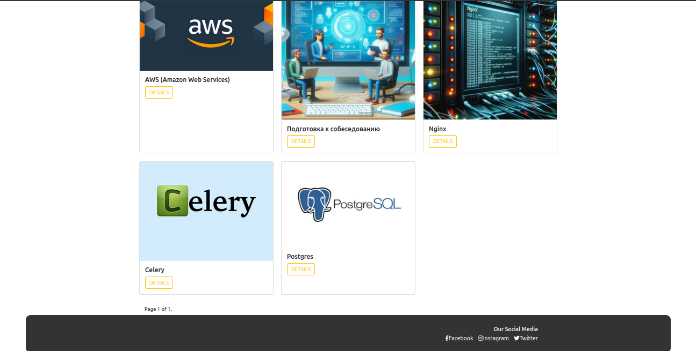
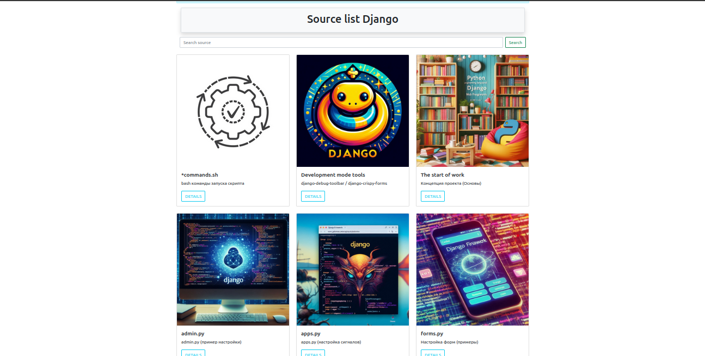
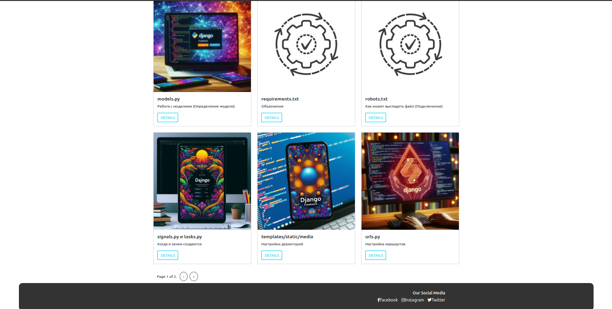
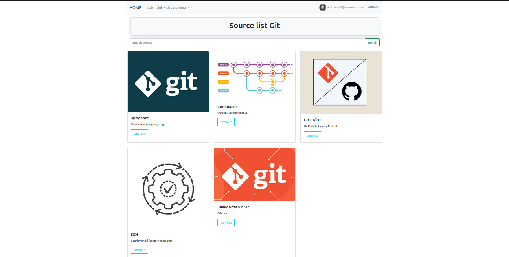
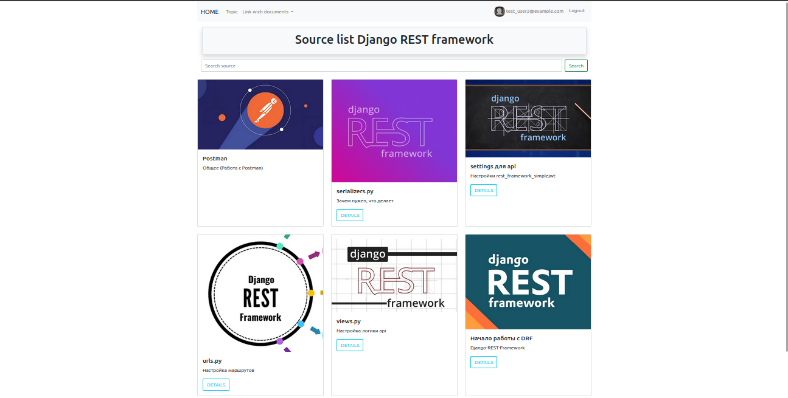

# Django Cheatsheets

- [Overview](#overview)
- [Requirements](#requirements)
- [Installation](#installation)
- [Usage](#usage)
- [Features](#features)
- [Demo_Images](#demo-images)

## Overview

**Django Cheatsheets** is an application that helps you create cheat sheets on any topic. You can add various links to sources that interest you. The application helps you gather all the necessary materials in one place, making it easier to access the information you need.


## Requirements


- Python 3.10+
- Django 5.1
- Django REST Framework
- SQLite from `dev` run mode/Postgres from `prod` run mode or another Django-supported database
- Celery (for asynchronous task handling)
- Docker/docker-compose
- JWT authentication (via rest_framework_simplejwt)
- SMTP settings for email notifications


## Installation

1. **Clone the repository:**
```bash
   git clone https://github.com/kulishovdmitriy/Django_Python_Cheatsheets.git
   cd django-cheatsheets
```

### To run on your machine:

1. Create a virtual environment and activate it:
```bash
    python -m venv venv
    source venv/bin/activate  # On Windows, use venv\Scripts\activate
```

2. Install the dependencies:
```bash
    pip install -r requirements.txt
```

Create a `.env` file based on the provided `.env.example` file:

    Copy the contents of .env.example to a new file named .env.
    Make sure to fill in any required values specific to your setup.

3. Set up the database (SQLite is used by default):
```bash
python manage.py migrate
```

4. Collect static files (this is necessary for their use in production):

```bash
python manage.py collectstatic
```

5. Create a superuser (for access to the admin panel):

```bash
python manage.py createsuperuser
```

6. Run the server:
```bash
    python manage.py runserver
```
`The API will be available at http://localhost:8000`

### To run with Docker Compose
`(Important: It is assumed that Docker and Docker Compose are already installed on your compute)`

1. Docker-compose run:
```bash
    docker compose up --build
```


## Usage


The project includes code examples organized into the following categories:

    Models: creating models, relationships, migration examples.
    Views: function-based and class-based view examples, request handling.
    Templates: template usage, Django Template Language (DTL), styling with Bootstrap.
    Forms: creating and validating forms, using built-in and custom forms.
    Admin: configuring the admin panel, registering models, customizing data display.
    REST API: setting up Django REST Framework, creating API endpoints, JWT authentication.

How to Use

    Open the relevant category to access code examples.
    Each category contains files with detailed comments and explanations.
    You can copy and use the code directly in your projects.

## Features

    Cheatsheets on Django essentials: simplify using models, views, forms, and templates.
    Django REST Framework guides: examples for creating APIs with JWT authentication.
    Examples of using Celery and Rabbitmq: for background task processing.
    Docker integration: simplifies project deployment and testing.


### Important!! To enable email confirmation and password reset functionality, you need to configure an SMTP server.


## Demo Images

Here are some screenshots of the application showing how your cheat sheets on various topics and subtopics could look.









